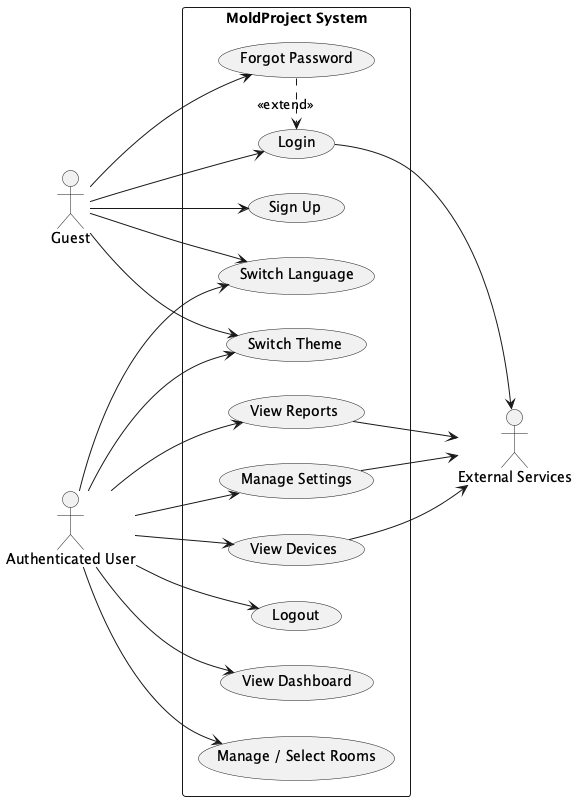
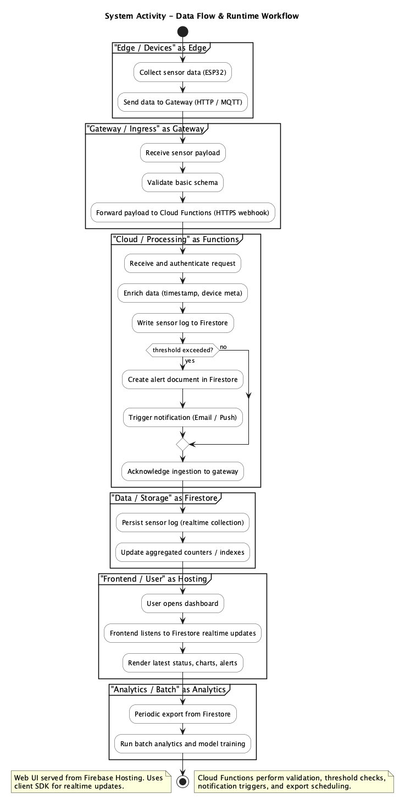
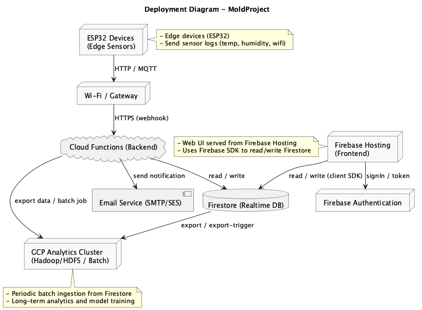

# MoldGuard — Smart Mold Prevention System

**An end-to-end data pipeline demonstrating IoT, Edge Computing, Serverless Cloud Computing, SaaS, and a Big Data Analytics Pipeline.**

---

## Project Overview

MoldGuard is a full-stack smart environment monitoring system designed to predict and prevent mold growth in residential and commercial indoor spaces. The system ingests real-time micro-climate telemetry from ESP32-based IoT sensor nodes, processes it through a serverless cloud backend, and renders actionable insights on a modern SaaS dashboard — all while feeding historical data into a Big Data analytics pipeline for multi-factor biological risk assessment.

The architecture is divided into four distinct engineering pillars:

1. **IoT & Edge Computing** — Hardware sensor nodes running local edge logic for autonomous ventilation control.
2. **Cloud Backend & Middleware** — Serverless Cloud Functions handling ingestion, alerting, and event-driven workflows.
3. **SaaS Frontend** — A real-time React dashboard for telemetry visualization, predictive risk monitoring, and system configuration.
4. **Big Data Analytics Pipeline** — An automated ETL and analysis workflow running on Hadoop (HDFS) with Python-based biological risk modeling.

---

## Comprehensive Tech Stack

| Layer | Technologies |
|---|---|
| **IoT & Edge** | C++, ESP32 Microcontroller, DHT22 (Temperature & Humidity), LDR (Light Sensor), Wokwi Simulator |
| **Web Frontend (SaaS)** | React, Vite, Tailwind CSS, Recharts, Lucide-React |
| **Cloud Backend (PaaS/BaaS)** | Google Firebase (Firestore, Authentication, Hosting) |
| **Middleware** | Node.js Serverless Cloud Functions, Nodemailer (SMTP) |
| **Big Data (IaaS)** | GCP Ubuntu Virtual Machines, Apache Hadoop (HDFS), Python (Pandas), Bash |

---

## The 4 System Pillars

### Pillar 1 — IoT & Edge Computing

The ESP32 microcontroller serves as the edge computing node, reading environmental data from a **DHT22** sensor (temperature and relative humidity) and an **LDR** photoresistor (ambient light level). All sensor data is transmitted to the cloud backend via Wi-Fi over HTTPS.

**Edge Logic (Local Autonomous Control):**

The firmware implements threshold-based actuator control directly on the microcontroller, eliminating dependency on cloud round-trips for time-critical responses:

- **Fan activation** at **≥ 70% RH** — initiates forced air circulation to lower localized humidity.
- **Dehumidifier activation** at **≥ 85% RH** — engages active moisture extraction when passive ventilation is insufficient.

**Hardware Design Decision — ADC2 Pin Avoidance:**

The LDR analog sensor is deliberately wired to an **ADC1** GPIO pin (e.g., GPIO 34 or 36). This is a critical hardware-level design choice: on the ESP32, **ADC2 pins are shared with the Wi-Fi radio driver** and become unavailable when Wi-Fi is active. Routing the LDR to an ADC2 pin would result in unpredictable analog reads or complete read failures during Wi-Fi transmission cycles. By constraining the LDR to ADC1, the system guarantees stable, conflict-free analog-to-digital conversion concurrent with continuous Wi-Fi telemetry uploads.

---

### Pillar 2 — Cloud Backend & Serverless Middleware

The cloud layer is built entirely on **Google Firebase**, leveraging Firestore as a NoSQL document database and Cloud Functions (2nd gen) as the serverless compute platform. Three distinct Cloud Functions form the middleware:

1. **`esp32api`** — A hardened Express.js endpoint handling real-time telemetry ingestion and **Automated System Backups**. It features a specialized `/api/run-backup` route designed to bypass regional IAM policy restrictions by leveraging existing function permissions.

2. **`checkMoldRisk`** — An event-driven Firestore trigger (`onDocumentCreated`) that fires on every new `SensorLogs` entry. It performs a multi-tenant device lookup to resolve the owning `userId`, reads the user's dynamic threshold from the `Settings` collection, and dispatches a styled HTML critical humidity alert email via Nodemailer when the threshold is exceeded.

3. **`notifyPredictiveAlert`** — A secondary Firestore trigger listening on the `AnalyticsAlerts` collection. When the Big Data pipeline writes a new predictive risk document, this function resolves the device owner, evaluates the severity suppression gate, and sends a predictive warning email.

**Automated Data Lifecycle (2nd Storage):**
The system implements a deduplicated backup pipeline that exports Firestore data to Cloud Storage as JSON. To ensure high availability in the `asia-southeast2` region despite strict organization policies, the backup is triggered via an external Cron-Job hitting a secured API endpoint, ensuring the "2nd Storage" requirement is met without data bloat.

**Anti-Spam Mechanisms:**

To prevent alert fatigue from sustained high-humidity environments, the system employs two distinct suppression layers:

- **Hysteresis Algorithm** — The `checkMoldRisk` function records a `lastAlertSent` timestamp on the device document after each successful email dispatch. Subsequent triggers within a **3-hour cooldown window** are silently suppressed, preventing rapid-fire duplicate emails while humidity remains elevated.

- **Dynamic Array-Based Email Suppression Gate** — The `notifyPredictiveAlert` function reads the user's `emailAlertLevels` array from Firestore (e.g., `['Medium', 'High']`). The incoming alert's `riskLevel` is checked against this array using an `Array.includes()` gate. If the risk level is not in the user's selected preferences, the email is suppressed. This gives users granular, multi-select control over which severity tiers generate email notifications.

---

### Pillar 3 — SaaS Frontend Dashboard

The frontend is a single-page React application built with **Vite** and styled with **Tailwind CSS**. It provides a real-time operational dashboard with multi-tenant data isolation enforced through Firebase Authentication and Firestore `where` clause filtering.

**Core Features:**

- **Real-Time Telemetry Listeners** — All room data, sensor logs, and device statuses are rendered via Firestore `onSnapshot` real-time listeners, ensuring the dashboard reflects the latest environmental state without manual refresh.

- **Predictive Dual-Risk Visualization** — The Analytics page displays predictive alerts generated by the Big Data pipeline. Each alert card renders two independent probability progress bars:
  - **General Mold Risk** (0–100%) — Probability of common mold colonization.
  - **Toxic Black Mold Risk** (0–100%) — Probability of *Stachybotrys chartarum* colonization.

  Progress bars are color-coded by severity: **emerald** (< 40%), **amber** (40–79%), and **red** (≥ 80%).

- **Historical Trend Aggregation** — Interactive area charts powered by **Recharts** display humidity and temperature trends over configurable timeframes (24h, 7d, 30d), with data aggregated into time-bucket averages.

- **Robust Threshold Configuration** — The Settings page exposes **4 distinct biological limit fields** that users can configure independently:
  1. General Mold — Safe Limit (% RH)
  2. General Mold — Critical Limit (% RH)
  3. Toxic Black Mold — Safe Limit (% RH)
  4. Toxic Black Mold — Critical Limit (% RH)

  Client-side validation enforces that Safe < Critical for each mold type, and a **hard cap of 90% RH** is enforced on the Black Mold Critical Limit as the biological ceiling for guaranteed *Stachybotrys chartarum* colonization.

- **Multi-Select Notification Preferences** — Users can independently toggle email notifications for **Low**, **Medium**, and **High** risk levels via a multi-select UI, which persists to Firestore and is enforced server-side by the Cloud Function suppression gate.

---

### Pillar 4 — Big Data Analytics Pipeline

The Big Data tier runs on **GCP Ubuntu Virtual Machines** provisioned with **Apache Hadoop** (HDFS) for distributed storage. An automated **ETL (Extract, Transform, Load)** process, orchestrated via **Bash** scripts, periodically exports sensor telemetry from Firestore into HDFS for batch analysis.

**Analytical Model — Effective Environmental Load:**

The core analytics engine is a **Python** script leveraging **Pandas** for data manipulation. It calculates the **"Effective Environmental Load"** — a composite risk score that amplifies raw humidity readings using biologically-motivated environmental multipliers:

- **Thermophilic Multiplier** — Temperatures within the optimal mold growth range (typically 25–30°C) amplify the effective humidity contribution. Readings outside this range apply a lower multiplier, reflecting reduced biological viability.

- **Photophobic Multiplier** — Low light conditions (indicative of enclosed, poorly-ventilated spaces where mold thrives) amplify the risk score. Higher ambient light levels reduce the multiplier, reflecting the inhibitory effect of UV exposure on mold sporulation.

The final Effective Environmental Load is compared against user-configured thresholds to produce a risk classification (Low, Medium, or High), which is written back to the `AnalyticsAlerts` Firestore collection to trigger downstream email notifications and dashboard visualization.

**Biological Hard-Cap Override:**

Regardless of user-configured thresholds, the analytics pipeline enforces a strict **90% RH biological hard-cap**. Any reading at or above this level is automatically classified as the highest risk tier, overriding all user preferences. This reflects the scientific consensus that 90% relative humidity guarantees active *Stachybotrys chartarum* (Toxic Black Mold) colonization on cellulose-based building materials.

---

## Getting Started

### Prerequisites

- **Node.js** (v18 or higher recommended)
- **npm** (bundled with Node.js)
- A configured **Firebase** project with Firestore, Authentication, and Hosting enabled

### 1. Frontend Dashboard (SaaS)

From the project root directory:

```bash
npm install
```

Start the Vite development server:

```bash
npm run dev
```

The application will launch locally at `http://localhost:5173`. All device data, room configurations, and user settings are synchronized in real-time with Google Firebase.

### 2. Cloud Functions (Serverless Middleware)

Navigate into the Cloud Functions directory:

```bash
cd functions
npm install
```

To deploy the functions to Firebase:

```bash
firebase deploy --only functions
```

> **Note:** Cloud Functions require environment variables (`ESP32_API_KEY`, `SMTP_USER`, `SMTP_PASS`, `ALERT_FROM_EMAIL`) to be configured in the `functions/.env` file. Copy `functions/.env.example` and populate with your credentials. These are automatically loaded by the Firebase runtime.

### 3. Firebase Configuration

Copy the root-level `.env.example` to `.env` and populate your Firebase project credentials:

```bash
cp .env.example .env
```

> **Security:** Environment files (`.env`) are excluded from version control via `.gitignore`. Never commit credentials to the repository.

---

## System Architecture Diagrams

Complete visualization of the MoldGuard system covering use cases, data flow, and deployment topology:

### Use Case Diagram



Displays all actors (Guest, Authenticated User, External Services) and use cases within the system, including the `<<extend>>` relationship where Forgot Password extends the Login functionality.

### System Activity Diagram



Visualizes data flow and runtime workflow, from edge devices (ESP32) collecting sensor data, through the gateway, Cloud Functions for processing, Firestore for storage, to the frontend dashboard and analytics batch pipeline.

### Deployment Diagram



Illustrates the runtime architecture and data flow between components: ESP32 edge devices, Firebase Hosting (frontend), Firebase Authentication, Firestore (database), Cloud Functions (backend), Email Service, and GCP Analytics Cluster.

**For comprehensive documentation**, refer to [docs/uml-diagrams.md](https://docs.google.com/document/d/1gT79mg7mwyrDwVnMwywcxqGdVZqUWkAq/edit?usp=sharing&ouid=105786420846292963880&rtpof=true&sd=true).

---

## License

This project was developed as part of an academic coursework submission and is intended for educational and portfolio demonstration purposes.


