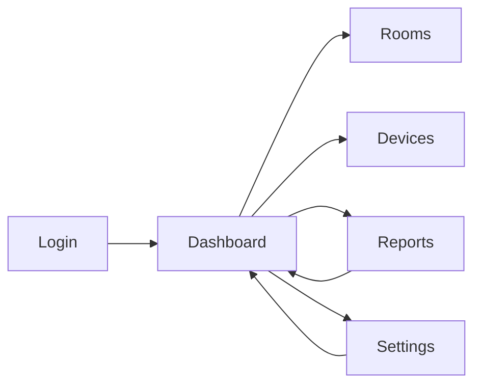
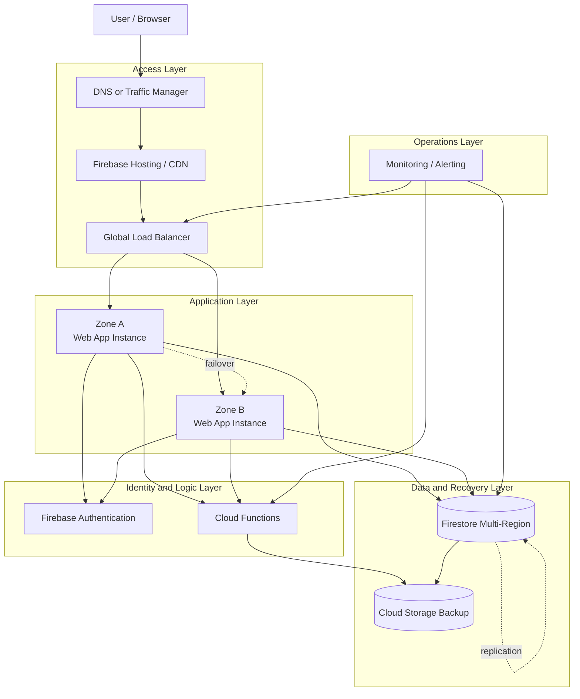

# MoldGuard PBL Final Report

This document is written for direct copy-paste into Microsoft Word or an academic report template. The content is fully in English and expanded so it can be used without rewriting from scratch. It is intentionally detailed so that, when moved into Word with normal spacing, margins, and manual image insertion, it can support a minimum 30-page final report.

## Supervisors

- Yoppy Yunhasnawa, S.ST., M.Sc.
- Agung Nugroho Pramudhita, S.T., M.T.
- Dian Hanifudin Subhi, S.Kom., M.Kom.

This report mirrors the Indonesian final report structure and is aligned with the following courses: Internet of Things, Framework-based Programming (Pemrograman Berbasis Framework), Cloud Computing, and Big Data.

## 1. Project Identity

MoldGuard is a cloud-first, IoT-based Smart Mold Prevention System designed to monitor, analyze, and help prevent mold growth risks in rooms. The system combines IoT sensors, Firebase, a responsive web dashboard, predictive alerts, threshold settings, and a bilingual interface so it can be used as a practical monitoring tool for both technical and non-technical users.

The project does more than display data. It transforms sensor readings into information that can be used for decision making. With this approach, users can understand when a room is still safe, when the risk is starting to increase, and when corrective action is needed immediately.

## Relation to Courses

This PBL project was prepared to integrate knowledge and practices from the following courses. The descriptions below explain how each course contributed to the final system implementation and design.

### Internet of Things
IoT provides the data acquisition layer in this project. Physical sensors (temperature, humidity, light, device state) collect environmental readings and deliver them to the backend. The IoT component focuses on reliable, periodic telemetry and device-to-cloud communication.

### Framework-based Programming (Pemrograman Berbasis Framework)
Frontend development uses React, TypeScript, and Vite to create a structured, component-based UI. This course's principles guided the creation of reusable components, routing, and state management to produce a maintainable and testable interface.

### Cloud Computing
Cloud usage is exemplified by Firebase Authentication, Firestore, and Cloud Functions. Cloud services host data, provide authentication, and run backend logic (ingest endpoints, risk evaluation, backups), demonstrating serverless cloud patterns taught in the course.

### Big Data
Big Data concepts show up in the handling of continuous sensor streams, historical storage, and trend analysis. While the project is not at industrial scale, it follows the practices of storing time-series data, computing aggregates, and preparing data for visualization and reporting.

## 2. Executive Summary

The main problem addressed by this project is mold risk, which appears when temperature, humidity, surface conditions, and exposure duration are not within a safe range. In real buildings, this issue affects occupant health, room comfort, material durability, and maintenance cost.

MoldGuard is designed as a monitoring and prevention system, not just as a dashboard display. The workflow starts from user login, room data loading, realtime sensor monitoring, risk evaluation, predictive alert display, and threshold adjustment when needed. In this way, the system helps the user move from observing data to making decisions.

## 3. Problem, Users, and Objectives

### 3.1 Problem
1. Temperature and humidity monitoring is often still manual, which makes mold-risk detection late.
2. Available sensor data is not always translated into clear operational decisions.
3. Room managers need an interface that can show safe, warning, and critical states in one simple view.

### 3.2 Main Users
1. Building or room managers who monitor environmental conditions on a daily basis.
2. Technicians or operators who maintain IoT devices, room assignments, and follow-up actions when alerts appear.
3. PBL reviewers or project evaluators who need evidence that the system works as a monitoring and prevention tool.

### 3.3 System Objectives
1. Provide realtime monitoring for temperature, humidity, light intensity, and device status.
2. Provide mold-risk prediction and alerts so action can be taken earlier.
3. Provide threshold, language, theme, and notification settings that are easy to understand.

## 4. Main Business Workflow

The main business flow starts with login and ends with corrective actions. The user signs in, the system loads the list of rooms or devices owned by the user, and the main dashboard shows realtime room conditions. The user can then move to the rooms page to review room summaries, the devices page to check connectivity and sensor data, the reports page to inspect alerts and data trends, and the settings page to adjust safe limits and notification preferences. When the session ends, the user logs out and the system theme returns to the configured default.

## 5. Core Data: Entities and Relationships

In the implementation, the core data is stored in Firestore and consumed by the frontend in realtime. The most important entities visible in the code are `Devices`, `SensorLogs`, `AnalyticsAlerts`, and `Settings`.

Rooms are not exposed as a separate collection in the main UI; instead, they are represented by documents in the `Devices` collection, which store the room name, `deviceID`, safe limit, critical limit, and appliance list. `SensorLogs` stores sensor history, while `AnalyticsAlerts` stores risk analysis and alert results. `Settings` stores user preferences such as thresholds, alert email, theme, and notification levels.

Cloud Functions act as the backend layer to receive sensor data, update device heartbeat, and trigger risk evaluation from Firestore events. This means the monitoring flow does not depend on the frontend alone; it also has a server-side process that keeps the data consistent.

### Data Relationships
- `USER` represents the account authenticated through Firebase Authentication.
- `SETTINGS` is stored per user so preferences persist across sessions.
- `DEVICE_ASSIGNMENT` represents one monitored room or unit linked to a `deviceID`.
- `SENSOR_LOG` is used for historical trends and charts.
- `ANALYTICS_ALERT` is used for predictive alert lists.

### 5.1 Explanation of Each Collection
**Devices** is the central room-management collection. Documents in this collection store room identity, ownership state, thresholds, and the appliance list. In the application UI, a room is treated as an object that can be selected, edited, or deleted.

**SensorLogs** stores raw readings from the device. Each log typically includes temperature, humidity, lightLevel, wifiSignal, fanStatus, dehumidifierStatus, deviceID, and timestamp. This collection is the basis for historical charts, device status checks, and mold-risk evaluation.

**AnalyticsAlerts** stores computed risk results or alert summaries. Its content may include risk percentages, short messages, environmental averages, and timestamps. The Reports page relies on this collection so users can read the summarized condition without checking raw data one by one.

**Settings** stores user-selected configuration. This collection matters because each user may need different thresholds. For example, some spaces require stricter humidity limits than others. Storing settings per account allows the system to adapt to different room needs.

### 5.2 Data Flow from Device to Dashboard
1. The IoT device sends sensor readings to the backend.
2. The backend stores the readings in Firestore under SensorLogs.
3. Cloud Functions perform additional evaluation and create alerts when thresholds are exceeded.
4. The frontend reads the Firestore data in realtime.
5. The Dashboard, Devices, Rooms, and Reports pages display the latest result to the user.

### 5.3 Why This Structure Matters
This structure matters because it transforms numbers into context. Users do not need to interpret raw readings manually. By separating sensor data, alert data, and settings data, the application becomes easier to maintain, easier to explain, and better prepared for future development.

## 6. Whether the Minimum Criteria Are Included

Yes, the minimum criteria are included explicitly in this document. To make it easier to check, the section below summarizes the required criteria and how MoldGuard fulfills them.

### 6.1 Required Minimum Criteria
1. The problem and the users must be clearly defined.
2. The main business workflow must be explainable from start to finish.
3. The core data or main entities must be available and their relationships must be explainable.
4. At least six MVP functional requirements must be written clearly.
5. The implemented features must be explained in a structured way.
6. Supporting visuals or diagrams must be available as references or attachments.

### 6.2 How MoldGuard Meets Them
1. **Clear problem and users**. The project focuses on mold risk detection and prevention for room managers, technicians, and PBL evaluators.
2. **Clear workflow**. The flow from login, dashboard monitoring, room management, device checking, reports, settings, and logout is defined in order.
3. **Clear core data**. The `Devices`, `SensorLogs`, `AnalyticsAlerts`, and `Settings` collections explain the data foundation of the system.
4. **Six MVP functional requirements**. Authentication, realtime dashboard, room management, device management, risk reports, and system settings are explained one by one.
5. **Feature implementation is described**. Each main page is explained together with its user value.
6. **Visual evidence is available**. Architecture, deployment, use case, and activity diagrams are already prepared in the project documentation.

### 6.3 Why This Section Matters in the Final Report
This section matters because lecturers or reviewers usually want to see that the project is not just a working UI, but a well-defined PBL product with clear analysis. The minimum criteria section shows that the project answers a real problem, has a defined user group, and includes enough functionality to prove the concept.

If this section is written clearly, the report is easier to evaluate because the reader can quickly verify whether all mandatory components exist. It also serves as a bridge between the conceptual explanation and the technical implementation.

## 7. Six MVP Functional Requirements

1. **User authentication**. The system must support login, signup, forgot password, and logout so data access is limited to authorized accounts.
2. **Realtime dashboard**. The system must display room status, temperature, humidity, light intensity, and mold-risk indicators on one main page.
3. **Room management**. The system must show a room list, allow the user to choose the active room, and provide edit and delete actions for room or device data.
4. **Device management**. The system must show device status, device ID, Wi-Fi signal strength, and online/offline state in realtime.
5. **Risk reports and alerts**. The system must show predictive alerts, sensor trends, and CSV export so users can review historical conditions and make decisions.
6. **System settings**. The system must let users change mold-risk thresholds, notification email, theme, language, and visual preferences such as the ripple effect.

### 7.1 Why These Six Features Were Chosen
These six features were chosen because each of them represents a core need of a real monitoring system. Authentication secures access. The realtime dashboard gives a quick overview of the current condition. Room management keeps the data organized. Device management helps diagnose hardware issues. Reports support analysis and decision making. Settings make the system flexible for different room conditions.

### 7.2 Relationship Between MVP and Future Development
An MVP does not mean the project is completely finished. It means the product already has a usable foundation that can be tested and demonstrated. After the MVP is in place, further development can include more advanced automation, richer email notifications, stronger prediction logic, and extra device integration.

## 8. Feature Implementation Explanation

### 8.1 Login, Signup, and Forgot Password
The application provides a complete authentication flow to ensure that data is only accessible to authorized users. The login page is the main entry point, while signup and forgot password support onboarding and account recovery. After successful authentication, the system loads the user-owned data from Firestore.

### 8.2 Main Dashboard
The dashboard shows room status, temperature cards, humidity cards, light cards, humidity history charts, and mold-risk gauges. This page lets users review the most important conditions without switching screens. It also includes appliance controls for the currently active room.

### 8.3 Rooms
The Rooms page shows the list of rooms connected to the user account. Each room card displays the latest temperature, latest humidity, Wi-Fi signal strength, and a safe, warning, or critical state. Users can select a room, edit the room name or device ID, and delete the room when needed.

### 8.4 Devices
The Devices page focuses on device status. The system checks the latest sensor updates to decide whether a device is still online, starting to slow down, or offline. Both desktop and mobile views emphasize device ID, room name, Wi-Fi condition, temperature, humidity, and connection status so technicians can diagnose issues faster.

### 8.5 Reports
The Reports page shows predictive alerts, sensor trends, 24-hour, 7-day, and 30-day filters, and a CSV export button. Alerts can be dismissed after review so the list stays clean and focused on active risks. This page is useful as analysis evidence because it combines historical data and risk summaries.

### 8.6 Settings
The Settings page is used to configure safe and critical thresholds for general mold and black mold, save alert email addresses, enable or disable alerts, and choose email alert levels. Theme and visual preferences are also stored in the user account so the experience stays consistent across sessions.

### 8.7 Additional Explanation per Page
**Login** is the main gate because all monitoring data is personal and tied to a specific account. This prevents data from mixing between users.

**Dashboard** functions as the summary page. On this page, users should understand the room condition within a few seconds, so the most important data is placed near the top.

**Rooms** is used to manage room entities. This page matters because one account may own more than one room. The user needs a clear way to select the active room.

**Devices** helps confirm whether the device is still healthy operationally. Wi-Fi signal and online/offline state are useful for determining whether the issue comes from the environment or from the device itself.

**Reports** adds value because not every decision can be made from the current reading alone. Historical data helps users see patterns, such as humidity spikes at certain times or a repeated increase in mold risk after specific conditions.

**Settings** provides flexibility because each building or room may have different characteristics. A poorly ventilated room needs tighter limits than a room with better airflow.

### 8.8 Why Cloud Functions Are Used
Cloud Functions are used because some processes should not live on the frontend. Examples include alert evaluation, sensor ingestion, heartbeat updates, and other backend logic that must run securely and consistently. This makes the system more modular and easier to explain as a cloud-first architecture.

## 9. Technical Strengths

1. **Realtime data flow**. Sensor data and alerts are read directly from Firestore, so updates appear without manual refresh.
2. **Responsive desktop and mobile layout**. The UI adjusts to screen size and remains readable on both desktop and mobile devices.
3. **Internationalization**. The application supports both Bahasa Indonesia and English through `i18next`.
4. **Theme management**. Light and dark themes can be preserved according to user preference.
5. **Threshold-based decision support**. The system does not only display numbers; it also groups them into safe, warning, and critical states.
6. **Cloud-first architecture**. The system uses the frontend, Firestore, and Cloud Functions so monitoring is centralized and easier to extend.

### 9.1 Impact of These Strengths on Users
These strengths are not only technical advantages on paper; they directly improve the user experience. Realtime data allows faster response to changes. Responsive desktop and mobile layouts keep the system usable across devices. Internationalization makes the presentation more flexible. Threshold-based support helps non-technical users understand the status without reading raw numbers. The cloud-first architecture helps scale the system when more rooms or devices are added.

### 9.2 Proposed High Availability Architecture

#### What Is High Availability
High Availability (HA) is an infrastructure design approach that aims to keep a system or service running continuously for a targeted percentage of uptime. In the context of IoT monitoring like MoldGuard, HA matters because delayed sensor data or an inaccessible dashboard means mold risk goes undetected.

Although this PBL does not fully implement production-grade HA at the infrastructure layer, the final report should still include a High Availability architecture plan to show how MoldGuard can evolve into a more resilient service.

#### Key HA Concepts Applied
| Concept | Explanation | MoldGuard Application |
|---|---|---|
| **Redundancy** | Providing more than one instance of the same component so that if one fails, the other continues serving. | Two application zones (Zone A and Zone B) run in parallel. |
| **Failover** | Automatically shifting traffic from a failed component to a healthy backup. | The load balancer routes traffic to the healthy zone when one zone experiences an issue. |
| **Data Replication** | Continuously copying data to another location so it remains available even if one location is disrupted. | Firestore multi-region replicates data across regions automatically. |
| **Health Monitoring** | Periodically checking the status of every component to detect failures as early as possible. | Monitoring / Alerting watches the load balancer, Cloud Functions, and Firestore. |
| **Backup and Recovery** | Periodically backing up data so it can be restored after an incident. | Cloud Storage stores backup data from Firestore and Cloud Functions. |

#### RTO and RPO Targets
- **RTO (Recovery Time Objective)**: The maximum time the system needs to resume operation after a disruption. In this plan the target RTO is under 5 minutes because failover between zones is handled automatically by the load balancer.
- **RPO (Recovery Point Objective)**: The maximum amount of data that can be lost due to a disruption. With synchronous Firestore multi-region replication, the target RPO approaches zero, meaning almost no data is lost during failover.

#### HA Architecture Diagram

The HA architecture diagram has been rendered from PlantUML to a PNG image ready for insertion into the Word report. The image file is located at `docs/assets/uml-ha-architecture.png`.

#### 9.2.1 HA Design Goals
1. Reduce the risk of single points of failure in access, application, and data layers.
2. Keep the service running even if one zone or instance fails.
3. Support automatic failover and health monitoring.
4. Provide a roadmap for future production-grade deployment.

#### 9.2.2 Per-Layer Explanation

**Access Layer (L1)** — This layer is the first entry point for users. DNS or a traffic manager directs requests to Firebase Hosting or a CDN. The CDN distributes static assets (HTML, CSS, JS) from the location closest to the user, reducing latency. The global load balancer then forwards requests to the application layer. If one CDN edge point fails, traffic is automatically rerouted to another edge point. This layer eliminates single points of failure on the access side.

**Application Layer (L2)** — Two application instances are placed in different zones (Zone A and Zone B) using an active-active pattern. This means both zones serve traffic simultaneously under normal conditions. If one zone experiences a disruption (e.g., a regional infrastructure issue), the load balancer automatically routes all traffic to the healthy zone. This pattern differs from active-passive, which only activates the standby when a failure occurs.

**Identity and Logic Layer (L3)** — Firebase Authentication and Cloud Functions are managed services whose availability is guaranteed by the cloud provider. Both application zones share the same Firebase Authentication service, so user login state is consistent across all zones. Cloud Functions handle server-side processes such as alert evaluation, sensor data ingestion, and device heartbeat updates.

**Data and Recovery Layer (L4)** — Firestore multi-region automatically replicates data across multiple regions so data remains available even if one region fails. Cloud Storage is used for periodic backups so data can be recovered in case of corruption or loss. The combination of real-time replication and periodic backups provides two layers of data protection.

**Operations Layer (L5)** — Monitoring and alerting continuously check the health of the load balancer, Cloud Functions, and Firestore. If any component enters an unhealthy state, the team receives a notification so it can investigate and take corrective action. This layer is critical for detecting problems before they impact end users.

#### 9.2.3 Proposed Components
- DNS or traffic manager for request routing.
- Firebase Hosting or CDN for stable frontend delivery.
- Global load balancer for traffic distribution.
- Two application instances in different zones for active-active behavior.
- Firestore multi-region for data replication.
- Cloud Functions for server-side validation, alerts, and backup workflows.
- Cloud Storage for backups.
- Monitoring / alerting for health checks and notifications.

#### 9.2.4 Mapping HA Components to MoldGuard
| HA Component | Current MoldGuard Implementation | Planned HA Enhancement |
|---|---|---|
| Frontend hosting | Firebase Hosting (single region) | Firebase Hosting + global CDN |
| Backend logic | Cloud Functions (single region) | Cloud Functions multi-region |
| Database | Firestore | Firestore multi-region (nam5 or eur3) |
| Authentication | Firebase Auth | Firebase Auth (already managed multi-region) |
| Backup | Not yet implemented | Scheduled Cloud Storage backup |
| Monitoring | Not yet implemented | Cloud Monitoring + alerting policies |
| Load balancing | Not yet implemented | Google Cloud Load Balancer |

#### 9.2.5 Why This Design Was Chosen
This design matches the cloud-first, web-based nature of the project. The frontend remains simple, while the report still shows how the system can be extended into a more resilient architecture if it is later moved into a stricter production environment. Additionally, all proposed components are available within the Google Cloud and Firebase ecosystem, so no platform migration is required.

## 10. Diagram and Visual Evidence

This section is written as plain text instead of markdown image links so it can be copied into Word easily and does not rely on clickable paths.

### Recommended Images to Insert into Word
- architecture.png
- uml-ha-architecture.png
- uml-use-case.png
- uml-system-activity.png
- uml-deployment.png
- uml-activity-login.png
- uml-activity-signup.png
- uml-activity-forgot-password.png
- uml-activity-dashboard.png
- uml-activity-room-management.png
- uml-activity-devices.png
- uml-activity-reports.png
- uml-activity-settings.png
- uml-activity-language-theme.png
- uml-activity-logout.png

### What the Diagrams Explain
The **use case diagram** shows the interaction between the user and the main system functions such as login, dashboard reading, room management, report viewing, setting adjustments, and logout. The **activity diagrams** explain the action sequence in more detail for each page. The **deployment diagram** shows the relationship between IoT devices, Firebase, the web frontend, and cloud data so readers understand that the system is not only a UI, but a full monitoring ecosystem.

### 10.1 How to Explain the Diagrams During Presentation
During presentation, the diagrams should not be mentioned merely as images. They should be used as evidence of the system design. The use case diagram can explain the feature scope. The activity diagram can explain the process logic. The deployment diagram can explain that the system has device, backend, and frontend layers that work together.

### 10.2 What Reviewers Usually Look For
Reviewers usually want to see whether the system actors are correct, whether the workflow makes sense, whether backend and frontend components match the implementation, and whether the diagrams reflect real application features. That is why the diagram explanation should be short but precise.

## 11. Implementation Results to Emphasize

1. The system separates page roles so information does not pile up on a single screen.
2. Realtime data is used on the dashboard, rooms, devices, and reports pages.
3. The system already has a bilingual UI, which is useful for presentations or demos across languages.
4. Threshold settings enable personalization for different room needs.
5. Reports and alerts help users move from simple monitoring toward decision making.
6. The server-side backend through Cloud Functions makes data ingestion and risk evaluation more consistent.

### 11.1 The Most Important Results to Mention
The most important thing to explain in the final report is that the system proves three main ideas. First, sensor data can really be used for monitoring. Second, the data can be turned into an interface that is easy to read. Third, the monitoring result can support decision making through alerts, history, and configurable settings.

### 11.2 Example Presentation Narrative
An effective presentation narrative would be: the application receives sensor data from an IoT device, stores it in Firestore, displays it in realtime on the dashboard, and then converts it into room status and risk alerts. In other words, the system does not just store data; it helps users understand room conditions in a practical way.

## 12. System Limitations

1. The system depends on Firebase connectivity and sensor data being sent to Firestore.
2. The quality of analysis depends on consistent sensor readings and on how well device IDs are mapped to rooms.
3. The system is a screening and monitoring tool, not a replacement for full field validation.
4. Some additional development aspects such as storage expansion and deeper automation can still be added in the next stage.

### 12.1 Limitations That Should Be Mentioned Honestly
In a final report, limitations should be written honestly so the project feels academic and realistic. A monitoring system like this cannot be considered perfect because its performance depends heavily on sensor quality, network connectivity, and whether device-to-room mapping is valid. Mentioning limitations actually strengthens the report because it shows that the developer understands the scope of the implementation.

## 13. Conclusion

MoldGuard successfully forms a clear PBL flow: the problem is defined, the users are defined, the business workflow can be executed, the core data is available, the six MVP functional requirements are covered as the main foundation, and the supporting visuals are prepared as report or presentation materials.

For that reason, the project is suitable to present as a realistic, structured, and easy-to-explain mold monitoring and prevention system for lecturers and reviewers. For Word usage, this document is already written in plain text so it can be copied without depending on markdown image links.

## 14. Copy-Paste Notes for Word

1. Copy the content of this document into the campus report template.
2. Add the group identity, supervisor, date, and introduction section if required.
3. Insert images manually into Word from the project documentation folder.
4. Keep the visuals consistent so the report looks neat and uniform.

## 15. Additional Material for a Minimum 30-Page Report

This section is intentionally added so the document can be expanded into a minimum 30-page report in Word. The material below can be turned into extra subsections if the campus template requires more detail.

### 15.1 System Requirements Analysis
System requirements analysis explains what the application must do in order to be useful. In MoldGuard, the main requirements are realtime monitoring, room management, device management, risk reporting, and threshold configuration. These needs arise from a real problem in humid room environments.

### 15.2 User Needs Analysis
Users need a fast-to-read interface, clear data, and simple navigation. That is why the application uses separate pages for separate tasks. This approach helps users focus on one type of activity at a time.

### 15.3 Usage Scenario
An example usage scenario is when an operator sees humidity rising close to the critical limit. The operator then opens the Reports page to inspect the previous pattern, checks the Settings page to see whether thresholds need adjustment, and records the condition if an alert appears. After that, the operator can follow up with field action.

### 15.4 Why Firebase Was Chosen
Firebase was chosen because it supports authentication, realtime database access, and cloud integration, which fit the needs of a monitoring system. With Firebase, sensor data can be read without building a complex backend from scratch.

### 15.5 Why React and Vite Were Chosen
React makes it easier to separate UI components such as dashboard, rooms, devices, reports, and settings. Vite was chosen because development is faster and the build process is lightweight. This combination is suitable for a PBL project that needs efficient development and a responsive interface.

### 15.6 Closing Note for Expansion
If the report still needs to be longer, the following sections can be added: system testing, page-by-page screenshots, before-and-after comparison, and a brief team reflection on the development process.