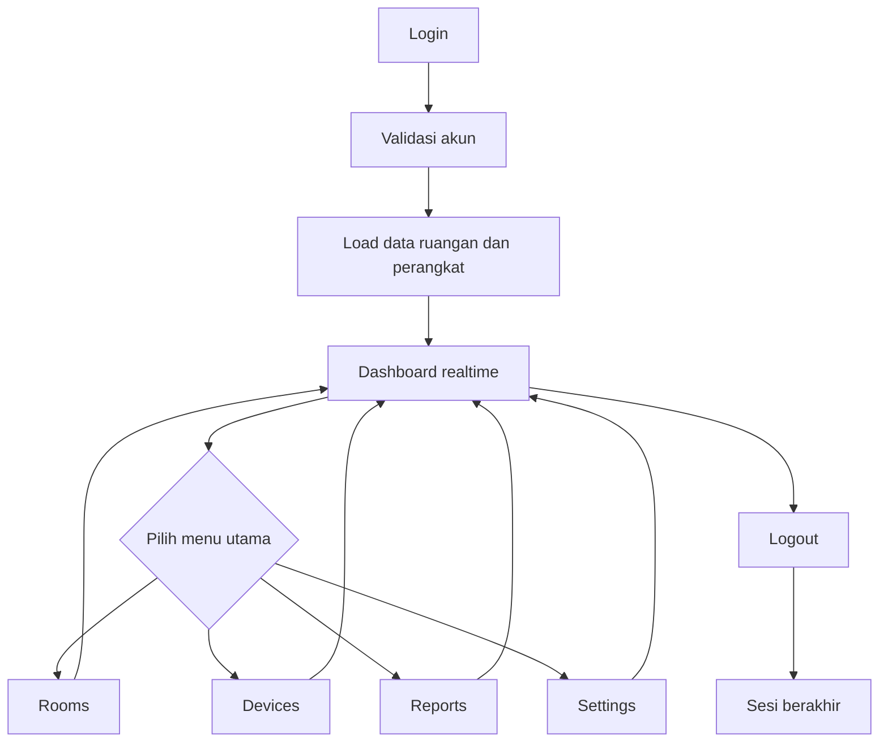

# Laporan Akhir Proyek PBL MoldGuard

## Dosen Pembimbing

- Yoppy Yunhasnawa, S.ST., M.Sc.
- Agung Nugroho Pramudhita, S.T., M.T.
- Dian Hanifudin Subhi, S.Kom., M.Kom.

Dokumen ini disusun untuk langsung dicopas ke Microsoft Word atau template laporan kampus. Seluruh isi ditulis dalam Bahasa Indonesia dengan gaya formal agar sesuai untuk laporan akhir. Isi dokumen ini juga cukup rinci sehingga dapat dikembangkan menjadi laporan minimum 30 halaman di Word, tergantung margin, spasi, ukuran font, dan penyisipan gambar manual.

## 1. Identitas Proyek

MoldGuard adalah Smart Mold Prevention System berbasis IoT dan cloud-first yang dirancang untuk memantau, menganalisis, dan membantu mencegah risiko pertumbuhan jamur pada ruangan. Sistem ini memadukan sensor IoT, Firebase, dashboard web responsif, notifikasi prediktif, pengaturan ambang batas, dan antarmuka bilingual sehingga dapat dipakai sebagai alat monitoring yang mudah dipahami oleh pengguna teknis maupun non-teknis.

Proyek ini tidak hanya menampilkan data, tetapi juga mengubah data sensor menjadi informasi yang dapat dipakai untuk pengambilan keputusan. Dengan pendekatan tersebut, pengguna dapat mengetahui kapan kondisi ruangan masih aman, kapan mulai berisiko, dan kapan perlu segera dilakukan tindakan korektif.

## 2. Keterkaitan dengan Mata Kuliah

Proyek PBL ini disusun sebagai integrasi beberapa mata kuliah utama, yaitu Internet of Things, Pemrograman Berbasis Framework, Cloud Computing, dan Big Data. Keempat mata kuliah tersebut tidak berdiri sendiri, tetapi saling melengkapi dalam satu sistem yang utuh.

### 2.1 Internet of Things
Kontribusi mata kuliah Internet of Things terlihat pada proses pengambilan data dari perangkat sensor yang memantau kondisi ruangan. Sensor suhu, kelembapan, cahaya, dan status perangkat menjadi sumber data utama yang dikirim ke sistem. Pada konteks proyek ini, IoT berperan sebagai lapisan akuisisi data dari dunia fisik ke sistem digital.

### 2.2 Pemrograman Berbasis Framework
Kontribusi mata kuliah Pemrograman Berbasis Framework terlihat pada pengembangan antarmuka web berbasis React, TypeScript, dan Vite. Halaman dashboard, rooms, devices, reports, settings, serta komponen reusable lain dibuat agar sistem mudah dikembangkan, responsif, dan terstruktur. Mata kuliah ini menjadi dasar implementasi frontend yang rapi dan konsisten.

### 2.3 Cloud Computing
Kontribusi mata kuliah Cloud Computing terlihat pada penggunaan Firebase Authentication, Firestore, dan Cloud Functions. Data sensor, akun pengguna, alert, dan pengaturan disimpan dan diproses secara terpusat di cloud sehingga sistem dapat diakses dari mana saja selama ada koneksi internet. Cloud juga memungkinkan proses backend berjalan tanpa server fisik yang dikelola manual.

### 2.4 Big Data
Kontribusi mata kuliah Big Data terlihat pada pengelolaan data sensor yang terus bertambah, penyimpanan histori, analisis tren, dan penyajian ringkasan kondisi dalam bentuk laporan. Walaupun skala proyek ini belum sebesar sistem industri, pola pengelolaannya sudah mengikuti prinsip data berkelanjutan, analisis historis, dan penyajian informasi yang siap digunakan untuk pengambilan keputusan.

## 3. Ringkasan Eksekutif

Masalah utama yang ditangani proyek ini adalah risiko jamur yang muncul ketika suhu, kelembapan, kondisi permukaan, dan durasi paparan tidak berada pada kondisi yang aman. Dalam bangunan nyata, masalah ini berdampak pada kesehatan penghuni, kenyamanan ruangan, daya tahan material, dan biaya perawatan.

MoldGuard dirancang sebagai sistem monitoring dan pencegahan, bukan sekadar tampilan dashboard. Alur kerjanya dimulai dari login pengguna, pemuatan data ruangan, pemantauan realtime sensor, penilaian risiko, penampilan alert prediktif, hingga penyesuaian pengaturan ambang batas jika diperlukan. Dengan begitu, sistem ini membantu pengguna bergerak dari tahap melihat data menuju tahap mengambil keputusan.

## 4. Masalah yang Diselesaikan, Pengguna, dan Tujuan

### 3.1 Masalah
1. Pemantauan suhu dan kelembapan masih sering dilakukan manual sehingga deteksi risiko jamur terlambat.
2. Data sensor yang tersedia sering belum diterjemahkan menjadi keputusan operasional yang jelas.
3. Pengelola ruangan membutuhkan antarmuka yang dapat menampilkan status aman, waspada, dan kritis dalam satu tampilan yang sederhana.

### 3.2 Pengguna Utama
1. Pengelola gedung atau ruangan yang memantau kondisi lingkungan secara harian.
2. Teknisi atau operator yang menangani perangkat IoT, pembaruan ruangan, dan tindak lanjut ketika ada peringatan.
3. Tim proyek atau penguji PBL yang membutuhkan bukti bahwa sistem bekerja sebagai alat monitoring dan pencegahan.

### 3.3 Tujuan Sistem
1. Menyediakan monitoring realtime untuk suhu, kelembapan, intensitas cahaya, dan status perangkat.
2. Menyediakan prediksi dan notifikasi risiko jamur agar tindakan dapat dilakukan lebih cepat.
3. Menyediakan pengaturan ambang batas, bahasa, theme, dan preferensi notifikasi yang mudah dipahami.

## 5. Workflow Bisnis Utama

Alur bisnis utama proyek ini berjalan dari login hingga tindakan korektif. Pengguna masuk ke aplikasi, sistem memuat daftar ruangan atau perangkat yang dimiliki pengguna, lalu dashboard utama menampilkan status kondisi ruangan secara realtime. Setelah itu pengguna dapat berpindah ke halaman ruangan untuk melihat ringkasan tiap ruang, ke halaman perangkat untuk memeriksa status konektivitas dan data sensor, ke halaman laporan untuk melihat alert dan tren data, serta ke halaman pengaturan untuk menyesuaikan batas aman dan preferensi notifikasi. Bila sesi selesai, pengguna melakukan logout dan tema sistem kembali mengikuti default yang telah ditetapkan.

Diagram ini menunjukkan bahwa dashboard menjadi pusat navigasi, sedangkan halaman Rooms, Devices, Reports, dan Settings berfungsi sebagai cabang yang kembali ke dashboard setelah selesai digunakan. Dengan pola ini, alur aplikasi lebih mudah dibaca saat laporan dicopas ke Word maupun saat dipresentasikan.

## 6. Data Inti: Entitas dan Relasi

Secara implementasi, data inti proyek ini tersimpan di Firestore dan dibaca secara realtime oleh frontend. Entitas paling penting yang terlihat pada kode adalah `Devices`, `SensorLogs`, `AnalyticsAlerts`, dan `Settings`.

Ruangan tidak dipisahkan sebagai collection tersendiri di tampilan utama, tetapi direpresentasikan oleh dokumen di collection `Devices` yang menyimpan nama ruangan, `deviceID`, batas aman, batas kritis, dan daftar appliance. `SensorLogs` menyimpan histori pembacaan sensor, sementara `AnalyticsAlerts` menyimpan hasil analisis risiko dan notifikasi. `Settings` menyimpan preferensi pengguna seperti ambang batas, email alert, theme, dan level notifikasi.

Cloud Functions dipakai sebagai lapisan backend untuk menerima data sensor, memperbarui heartbeat perangkat, dan memicu evaluasi risiko dari event Firestore. Dengan demikian, alur monitoring tidak bergantung pada frontend saja, tetapi juga memiliki proses server-side yang menjaga data tetap konsisten.

### Relasi Data
- `USER` merepresentasikan akun yang login melalui Firebase Authentication.
- `SETTINGS` tersimpan per user agar preferensi tidak hilang saat pengguna berpindah sesi.
- `DEVICE_ASSIGNMENT` merepresentasikan satu ruangan atau unit monitoring yang terhubung ke `deviceID`.
- `SENSOR_LOG` dipakai untuk tren histori dan grafik.
- `ANALYTICS_ALERT` dipakai untuk daftar peringatan prediktif.

### 6.1 Penjelasan Setiap Collection
**Devices** adalah pusat pengelolaan ruangan. Dokumen pada collection ini menyimpan atribut identitas ruangan, status kepemilikan, batas-batas yang dipakai untuk penilaian, dan daftar appliance yang terhubung. Dalam tampilan aplikasi, ruangan diperlakukan sebagai objek yang bisa dipilih, diedit, atau dihapus.

**SensorLogs** menyimpan data mentah dari perangkat. Setiap log biasanya berisi temperature, humidity, lightLevel, wifiSignal, fanStatus, dehumidifierStatus, deviceID, dan timestamp. Collection ini menjadi dasar untuk grafik historis, pemeriksaan status perangkat, dan evaluasi risiko jamur.

**AnalyticsAlerts** menyimpan hasil analisis atau peringatan yang sudah dihitung dari data sensor. Isi datanya dapat berupa persentase risiko, pesan singkat, rata-rata lingkungan, dan timestamp. Collection ini dipakai pada halaman Reports agar pengguna dapat melihat ringkasan kondisi tanpa harus membuka data mentah satu per satu.

**Settings** menyimpan konfigurasi yang dipilih pengguna. Data ini penting karena setiap pengguna bisa memiliki batas aman yang berbeda. Misalnya, sebagian ruang membutuhkan batas kelembapan yang lebih ketat daripada ruang lain. Dengan menyimpan setting per akun, sistem dapat menyesuaikan interpretasi data sesuai kebutuhan pengguna.

### 6.2 Alur Data dari Perangkat ke Dashboard
1. Perangkat IoT mengirim pembacaan sensor ke backend.
2. Backend menyimpan data ke Firestore pada collection SensorLogs.
3. Cloud Functions melakukan evaluasi tambahan untuk membuat alert jika ambang batas terlampaui.
4. Frontend membaca data Firestore secara realtime.
5. Dashboard, Devices, Rooms, dan Reports menampilkan data terbaru kepada pengguna.

### 6.3 Mengapa Struktur Data Ini Penting
Struktur data ini penting karena membuat sistem tidak hanya menampilkan angka, tetapi juga mengubah angka menjadi konteks. Pengguna tidak perlu menafsirkan data mentah secara manual. Dengan adanya pemisahan antara data sensor, data alert, dan data setting, aplikasi menjadi lebih mudah dipelihara, lebih jelas saat dijelaskan, dan lebih siap untuk dikembangkan pada tahap berikutnya.

## 7. Kriteria Minimum PBL

Ya, kriteria minimum sudah dicantumkan secara eksplisit di bagian ini. Agar lebih jelas, berikut ringkasan kriteria minimum yang harus ada pada laporan akhir dan bagaimana MoldGuard memenuhinya.

### 7.1 Kriteria Minimum yang Harus Ada
1. Masalah dan pengguna harus jelas.
2. Workflow bisnis utama harus dapat dijelaskan dari awal sampai akhir.
3. Data inti atau entitas utama harus tersedia dan dapat dijelaskan relasinya.
4. Minimal enam kebutuhan fungsional MVP harus tertulis jelas.
5. Fitur yang benar-benar dibuat harus dijelaskan secara runtut.
6. Bukti visual atau diagram pendukung harus tersedia sebagai lampiran atau referensi.

### 7.2 Pemenuhan pada Proyek MoldGuard
1. **Masalah dan pengguna jelas**. Proyek ini fokus pada deteksi dan pencegahan risiko jamur pada ruangan dengan target pengguna pengelola ruang, teknisi, dan penguji PBL.
2. **Workflow bisnis jelas**. Alur login, pemantauan dashboard, pengelolaan room, pengecekan device, laporan, pengaturan, dan logout sudah dipetakan dengan runtut.
3. **Data inti jelas**. Collection `Devices`, `SensorLogs`, `AnalyticsAlerts`, dan `Settings` sudah menjelaskan inti data sistem.
4. **Enam kebutuhan fungsional MVP tercantum**. Autentikasi, dashboard realtime, room management, device management, risk reports, dan system settings sudah dijelaskan satu per satu.
5. **Implementasi fitur dijabarkan**. Setiap halaman utama memiliki penjelasan fungsi dan manfaat penggunaannya.
6. **Bukti visual tersedia**. Diagram arsitektur, deployment, use case, dan activity diagram sudah tersedia di folder dokumentasi proyek.

## 8. Enam Kebutuhan Fungsional Utama

1. **Autentikasi pengguna**. Sistem harus mendukung login, signup, forgot password, dan logout agar akses data hanya diberikan kepada akun yang berwenang.
2. **Dashboard realtime**. Sistem harus menampilkan status ruangan, suhu, kelembapan, intensitas cahaya, dan indikator risiko jamur dalam satu halaman utama.
3. **Manajemen ruangan**. Sistem harus menampilkan daftar ruangan, memungkinkan pengguna memilih ruangan aktif, serta memberi opsi edit dan hapus data ruangan/perangkat.
4. **Manajemen perangkat**. Sistem harus menampilkan status perangkat, ID perangkat, kekuatan sinyal Wi-Fi, dan status online atau offline secara realtime.
5. **Laporan dan notifikasi risiko**. Sistem harus menampilkan alert prediktif, tren data sensor, dan export CSV agar pengguna bisa membaca kondisi secara historis dan mengambil keputusan.
6. **Pengaturan sistem**. Sistem harus memungkinkan pengguna mengubah ambang batas risiko jamur, email notifikasi, theme, bahasa, dan preferensi visual seperti ripple effect.

### 8.1 Rasional Pemilihan Fitur
Enam fitur utama ini dipilih karena masing-masing merepresentasikan kebutuhan inti dari sistem monitoring yang dapat digunakan secara nyata. Autentikasi memastikan keamanan akses. Dashboard realtime memastikan pengguna mendapatkan gambaran kondisi aktual. Room management memastikan data ruangan tetap rapi. Device management membantu diagnosis perangkat. Reports membantu analisis dan pengambilan keputusan. Settings memungkinkan sistem tetap fleksibel untuk berbagai kondisi ruangan.

### 8.2 Hubungan dengan Pengembangan Lanjutan
Enam fitur utama ini menjadi fondasi minimum sistem. Setelah fondasi ini tersedia, pengembangan berikutnya dapat diarahkan pada otomasi yang lebih canggih, notifikasi email yang lebih lengkap, prediksi berbasis model yang lebih kuat, integrasi perangkat tambahan, dan perluasan skenario penggunaan.

## 9. Penjelasan Implementasi Fitur

### 9.1 Login, Signup, dan Forgot Password
Aplikasi menyediakan alur autentikasi lengkap untuk memastikan data hanya dapat diakses oleh pengguna yang sah. Halaman login menjadi pintu utama aplikasi, sedangkan signup dan forgot password mendukung onboarding dan pemulihan akun. Setelah autentikasi berhasil, sistem memuat data milik pengguna dari Firestore.

### 9.2 Dashboard Utama
Dashboard menampilkan status ruangan, kartu suhu, kartu kelembapan, kartu cahaya, grafik riwayat kelembapan, dan gauge risiko jamur. Di area ini pengguna dapat melihat kondisi paling penting tanpa harus berpindah halaman. Dashboard juga menyertakan kontrol appliance untuk perangkat yang terdaftar pada ruangan aktif.

### 9.3 Rooms
Halaman Rooms menampilkan daftar ruangan yang terhubung ke akun pengguna. Setiap kartu ruangan menampilkan suhu terakhir, kelembapan terakhir, kekuatan sinyal Wi-Fi, dan status aman, warning, atau critical. Pengguna dapat memilih ruangan tertentu, mengubah nama atau device ID, dan menghapus ruangan bila diperlukan.

### 9.4 Devices
Halaman Devices fokus pada status perangkat. Sistem memeriksa pembaruan sensor terbaru untuk menentukan apakah perangkat masih online, mulai melambat, atau offline. Tampilan desktop dan mobile sama-sama menonjolkan ID perangkat, nama ruangan, kondisi Wi-Fi, suhu, kelembapan, dan status koneksi agar teknisi dapat melakukan diagnosis lebih cepat.

### 9.5 Reports
Halaman Reports menampilkan predictive alerts, tren data sensor, filter rentang waktu 24 jam, 7 hari, dan 30 hari, serta tombol export CSV. Alert dapat dihapus setelah dibaca sehingga daftar tetap bersih dan fokus pada risiko aktif. Halaman ini cocok dipakai sebagai bukti analisis karena menyatukan data historis dan ringkasan risiko.

### 9.6 Settings
Halaman Settings dipakai untuk menyesuaikan ambang batas aman dan kritis untuk mold umum dan black mold, menyimpan email alert, mengaktifkan atau menonaktifkan notifikasi, serta memilih level email alert. Theme dan preferensi visual juga disimpan di akun pengguna agar pengalaman penggunaan konsisten antar sesi.

### 9.7 Penjelasan Tambahan per Halaman
**Login** menjadi pintu masuk utama karena semua data monitoring bersifat personal dan terikat ke akun tertentu. Hal ini mencegah data campur antara satu pengguna dengan pengguna lain.

**Dashboard** berfungsi sebagai halaman ringkasan. Pada halaman ini, pengguna sebaiknya dapat memahami kondisi ruangan hanya dalam beberapa detik. Karena itu, data yang paling penting ditempatkan di bagian atas.

**Rooms** dipakai untuk mengelola entitas ruangan. Halaman ini penting karena satu akun dapat memiliki lebih dari satu ruangan. Pengguna perlu bisa memilih ruangan yang sedang aktif tanpa kebingungan.

**Devices** membantu memastikan perangkat masih sehat secara operasional. Informasi seperti Wi-Fi signal dan status online/offline sangat berguna untuk membedakan apakah masalah berasal dari lingkungan ruangan atau dari perangkat itu sendiri.

**Reports** memberi nilai tambah karena tidak semua keputusan bisa diambil dari data saat itu juga. Riwayat data membantu pengguna melihat pola, misalnya apakah kelembapan naik di jam tertentu atau apakah risiko jamur meningkat setelah kondisi tertentu.

**Settings** memberi fleksibilitas karena setiap bangunan atau ruang bisa memiliki karakteristik berbeda. Ruang dengan ventilasi buruk tentu membutuhkan batas yang lebih ketat daripada ruang lain.

### 9.8 Alasan Penggunaan Cloud Functions
Cloud Functions dipakai karena beberapa proses sebaiknya tidak diletakkan di frontend. Contohnya adalah evaluasi alert, penerimaan data sensor, pembaruan heartbeat perangkat, dan proses backend lain yang harus berjalan aman dan konsisten. Dengan cara ini, sistem menjadi lebih modular dan lebih mudah dijelaskan sebagai arsitektur cloud-first.

## 10. Kelebihan Teknis

1. **Realtime data flow**. Data sensor dan alert dibaca langsung dari Firestore sehingga perubahan dapat terlihat tanpa refresh manual.
2. **Responsif desktop dan mobile**. Layout menyesuaikan ukuran layar agar tetap terbaca pada desktop maupun perangkat mobile.
3. **Internationalization**. Aplikasi mendukung Bahasa Indonesia dan English melalui `i18next`.
4. **Theme management**. Theme terang atau gelap dapat dipertahankan sesuai preferensi pengguna.
5. **Threshold-based decision support**. Sistem tidak hanya menampilkan angka, tetapi juga mengelompokkannya menjadi status aman, warning, dan critical.
6. **Arsitektur cloud-first**. Sistem memakai frontend, Firestore, dan Cloud Functions sehingga alur monitoring berjalan terpusat dan lebih mudah dikembangkan.

### 10.1 Dampak Kelebihan Ini bagi Pengguna
Kelebihan teknis di atas bukan hanya nilai teknis di atas kertas, tetapi juga memberi dampak langsung ke pengalaman pengguna. Realtime data membuat pengguna lebih cepat merespons perubahan. Responsif desktop dan mobile membuat sistem tetap nyaman dipakai dari perangkat apa pun. Internationalization membuat presentasi lebih fleksibel. Threshold-based support membantu pengguna non-teknis memahami status tanpa harus membaca angka mentah. Arsitektur cloud-first memudahkan skalabilitas ketika jumlah ruangan atau perangkat bertambah.

## 11. Penjelasan Diagram dan Bukti Visual

Bagian ini sengaja ditulis sebagai daftar teks, bukan markdown image, supaya mudah dipindahkan ke Word dan tidak tergantung pada link file. Jika ingin memasukkan gambar ke laporan Word, cukup gunakan file yang sudah tersedia di folder dokumentasi proyek.

### Gambar yang Disarankan untuk Dimasukkan ke Word
- architecture.png
- uml-use-case.png
- uml-system-activity.png
- uml-deployment.png
- uml-activity-login.png
- uml-activity-signup.png
- uml-activity-forgot-password.png
- uml-activity-dashboard.png
- uml-activity-room-management.png
- uml-activity-devices.png
- uml-activity-reports.png
- uml-activity-settings.png
- uml-activity-language-theme.png
- uml-activity-logout.png

### Fungsi Penjelasan Diagram
**Use case diagram** menunjukkan interaksi antara pengguna dan fungsi utama sistem seperti login, membaca dashboard, mengelola ruangan, melihat laporan, mengubah pengaturan, dan logout. **Activity diagram** menjelaskan urutan tindakan secara lebih rinci untuk tiap halaman. **Deployment diagram** memperlihatkan hubungan antara perangkat IoT, Firebase, frontend web, dan data cloud sehingga pembaca langsung memahami bahwa sistem ini bukan hanya UI, tetapi ekosistem monitoring yang terhubung.

### 11.1 Cara Menjelaskan Diagram Saat Presentasi
Saat presentasi, diagram sebaiknya tidak hanya disebutkan sebagai gambar, tetapi dijelaskan sebagai bukti alur sistem. Use case diagram dapat dipakai untuk menunjukkan ruang lingkup fitur. Activity diagram dapat dipakai untuk menunjukkan logika proses. Deployment diagram dapat dipakai untuk menunjukkan bahwa sistem memiliki lapisan perangkat, backend, dan frontend yang saling berhubungan.

### 11.2 Hal yang Perlu Diperhatikan Penguji
Penguji biasanya ingin melihat apakah aktor sistem sudah benar, apakah alurnya masuk akal, apakah komponen backend dan frontend cocok dengan implementasi, serta apakah diagram tersebut sesuai dengan fitur nyata yang ada di aplikasi. Karena itu, gambar sebaiknya didukung dengan penjelasan singkat namun tepat.

## 12. Hasil Implementasi yang Perlu Ditekankan

1. Sistem sudah memisahkan peran halaman agar informasi tidak menumpuk di satu layar.
2. Data realtime dipakai pada halaman dashboard, rooms, devices, dan reports.
3. Sistem sudah memiliki bilingual UI sehingga cocok untuk presentasi atau demo lintas bahasa.
4. Pengaturan threshold memberi ruang personalisasi sesuai kebutuhan ruang yang berbeda.
5. Laporan dan alert membantu pengguna berpindah dari sekadar monitoring menjadi pengambilan keputusan.
6. Backend server-side melalui Cloud Functions membuat sistem lebih konsisten dalam ingest data dan evaluasi risiko.

### 12.1 Hasil Implementasi yang Paling Penting untuk Diceritakan
Yang paling penting untuk diceritakan dalam laporan akhir adalah bahwa sistem sudah membuktikan tiga hal utama. Pertama, data sensor benar-benar bisa dipakai sebagai data monitoring. Kedua, data tersebut bisa diterjemahkan menjadi tampilan yang mudah dibaca. Ketiga, hasil monitoring bisa dipakai untuk mendukung pengambilan keputusan melalui alert, riwayat, dan pengaturan yang dapat disesuaikan.

### 12.2 Contoh Narasi Presentasi
Contoh narasi presentasi yang baik adalah: aplikasi ini menerima data sensor dari perangkat IoT, menyimpannya di Firestore, menampilkannya secara realtime di dashboard, lalu mengolahnya menjadi status ruangan dan alert risiko. Dengan demikian, sistem tidak hanya menyimpan data, tetapi juga membantu pengguna memahami kondisi ruangan secara praktis.

## 13. Batasan Sistem

1. Sistem bergantung pada koneksi Firebase dan data sensor yang dikirim ke Firestore.
2. Kualitas analisis sangat tergantung pada konsistensi pembacaan sensor dan kualitas device ID yang dipetakan ke ruangan.
3. Sistem ini adalah alat screening dan monitoring, bukan pengganti validasi lapangan penuh.
4. Beberapa aspek pengembangan tambahan seperti ekspansi storage dan otomasi lebih lanjut masih dapat dikembangkan pada tahap berikutnya.

### 13.1 Batasan yang Perlu Disebutkan Secara Jujur
Dalam laporan akhir, batasan perlu ditulis jujur agar proyek terlihat akademik dan realistis. Sistem monitoring seperti ini tidak bisa dianggap sempurna karena performanya sangat dipengaruhi oleh kualitas sensor, koneksi jaringan, dan validitas mapping device ke ruangan. Menyebutkan batasan justru memperkuat laporan karena menunjukkan bahwa pengembang memahami ruang lingkup implementasi.

## 14. Kesimpulan

MoldGuard berhasil membentuk alur PBL yang jelas: masalah terdefinisi, pengguna terdefinisi, workflow bisnis bisa dijalankan, data inti tersedia, enam kebutuhan fungsional MVP terpenuhi sebagai fondasi utama, dan visual pendukung sudah disiapkan sebagai bahan laporan atau presentasi.

Dengan demikian, proyek ini layak dipresentasikan sebagai sistem monitoring dan pencegahan jamur yang realistis, terstruktur, dan mudah dijelaskan kepada dosen maupun penguji. Untuk kebutuhan Word, dokumen ini sudah dibuat dalam bentuk teks yang mudah disalin tanpa ketergantungan pada markdown gambar.

## 15. Catatan untuk Copas ke Word

1. Salin isi dokumen ini ke template laporan kampus.
2. Tambahkan identitas kelompok, dosen pembimbing, tanggal, dan bagian pendahuluan jika diperlukan.
3. Sisipkan gambar dari folder dokumentasi secara manual ke dokumen Word.
4. Gunakan file gambar yang konsisten agar laporan terlihat rapi dan seragam.

## 16. Materi Tambahan untuk Memenuhi Minimum 30 Halaman

Bagian ini sengaja ditambahkan agar dokumen dapat diperpanjang menjadi laporan minimum 30 halaman saat dipindahkan ke Word. Isi berikut dapat dijadikan subbab tambahan jika template kampus membutuhkan detail lebih banyak.

### 16.1 Analisis Kebutuhan Sistem
Analisis kebutuhan sistem menjelaskan apa yang harus dilakukan aplikasi agar benar-benar berguna. Pada MoldGuard, kebutuhan utama adalah monitoring realtime, pengelolaan ruangan, pengelolaan perangkat, laporan risiko, dan pengaturan ambang batas. Kebutuhan ini muncul dari masalah nyata di lingkungan ruangan yang lembap.

### 16.2 Analisis Kebutuhan Pengguna
Pengguna membutuhkan tampilan yang cepat dibaca, data yang jelas, dan alur navigasi yang tidak rumit. Karena itu, aplikasi menggunakan halaman yang terpisah per fungsi. Pendekatan ini membantu pengguna fokus pada satu jenis tugas dalam satu waktu.

### 16.3 Skenario Penggunaan
Contoh skenario penggunaan adalah ketika operator melihat bahwa kelembapan naik mendekati batas kritis. Operator kemudian membuka halaman laporan untuk memeriksa pola sebelumnya, lalu membuka settings untuk mengecek apakah threshold perlu disesuaikan. Jika alert muncul, operator dapat mencatat kondisi dan mengambil tindakan lapangan.

### 16.4 Alasan Pemilihan Firebase
Firebase dipilih karena mendukung autentikasi, database realtime, dan integrasi cloud yang sesuai dengan kebutuhan monitoring. Dengan Firebase, data sensor dapat dibaca tanpa membuat backend yang rumit dari nol.

### 16.5 Alasan Pemilihan React dan Vite
React memudahkan pemisahan komponen UI seperti dashboard, rooms, devices, reports, dan settings. Vite dipilih karena proses development lebih cepat dan build lebih ringan. Kombinasi ini cocok untuk PBL yang membutuhkan pengembangan yang efisien dan tampilan yang responsif.

### 16.6 Penutup Tambahan
Jika laporan masih perlu diperpanjang, bagian berikut dapat ditambahkan lagi: pengujian sistem, hasil screenshot per halaman, perbandingan sebelum dan sesudah implementasi, dan refleksi pribadi tim terhadap proses pengembangan.