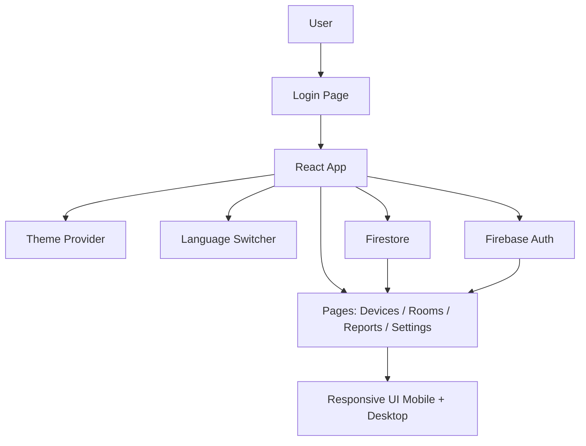

# Overview Arsitektur

Dokumen ini menjelaskan struktur aplikasi, alur data, dan komponen utama sistem.

## 1. Ringkasan Sistem

Proyek ini adalah aplikasi React + TypeScript yang berjalan di atas Vite, memakai Firebase untuk autentikasi dan data realtime, serta Tailwind CSS untuk styling responsif.

## 2. Stack Utama

- Frontend: React, TypeScript, Vite
- Styling: Tailwind CSS
- Theme: `next-themes`
- Backend: Firebase Authentication, Firestore, dan Cloud Functions
- UI Library: Radix UI, Lucide React, Sonner
- Internationalization: `i18next` dan `react-i18next`

## 3. Struktur Folder Penting

- `src/App.tsx` — bootstrap aplikasi dan routing utama.
- `src/main.tsx` — entry point aplikasi.
- `src/components/` — komponen reusable.
- `src/pages/` — halaman utama aplikasi.
- `src/lib/` — helper, Firebase init, dan utilitas.
- `src/locales/` — file bahasa.
- `functions/` — backend serverless bila digunakan.

## 4. Diagram Arsitektur

## 5. Alur Data Utama

1. User membuka aplikasi dan masuk melalui halaman login.
2. Firebase Authentication memvalidasi identitas user.
3. Aplikasi membaca data profile, settings, dan data perangkat dari Firestore.
4. UI merender data secara realtime dengan listener yang sesuai.
5. Perubahan bahasa dan theme dikelola di sisi frontend.

## 6. Pola Responsif

Dokumen dan implementasi UI mengikuti prinsip berikut:

- Desktop tetap mempertahankan layout utama.
- Mobile memakai layout yang lebih ringkas.
- Elemen yang bersifat visual-only, seperti header mobile dan modal logout, diatur dengan breakpoint Tailwind.

## 7. Pengelolaan Theme

Theme menggunakan `next-themes` dengan class-based switching.

- Theme dipilih di frontend.
- Theme tidak boleh berubah otomatis saat login jika user sudah memilih theme tertentu.
- Preferensi theme dapat disinkronkan dengan settings user bila memang dibutuhkan.

## 8. Pengelolaan Bahasa

Bahasa dikelola melalui file locale di `src/locales/`.

- `en.json` untuk English.
- `id.json` untuk Bahasa Indonesia.
- `LanguageSwitcher` dipakai di login dan area aplikasi.

## 9. Screenshot Referensi yang Disarankan

- `assets/architecture-desktop.png` — desktop dashboard.
- `assets/architecture-mobile.png` — tampilan mobile.
- `assets/architecture-flow.png` — diagram arsitektur final.
