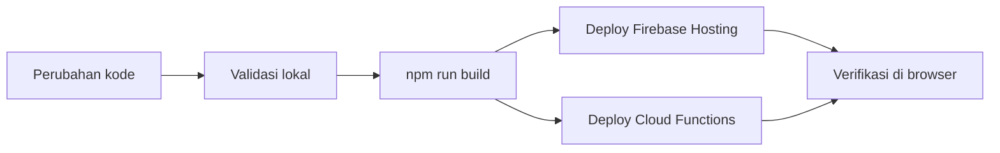

# Panduan Deploy

Dokumen ini menjelaskan langkah deploy aplikasi frontend dan backend ke environment produksi.

## 1. Gambaran Umum

Alur deploy yang disarankan:



## 2. Prasyarat Deploy

- Firebase CLI sudah terpasang.
- Sudah login ke Firebase dengan akun yang benar.
- Project Firebase sudah terhubung ke repository ini.
- Semua environment production sudah disiapkan.

## 3. Validasi Sebelum Deploy

Jalankan build terlebih dahulu:

```bash
npm run build
```

Jika ada perubahan pada folder `functions/`, masuk ke folder tersebut dan install dependensi:

```bash
cd functions
npm install
```

## 4. Deploy Frontend

Jalankan deploy hosting setelah build selesai:

```bash
firebase deploy --only hosting
```

## 5. Deploy Cloud Functions

Jika backend memakai Cloud Functions:

```bash
firebase deploy --only functions
```

Jika perlu deploy sekaligus:

```bash
firebase deploy
```

## 6. Langkah Verifikasi Setelah Deploy

1. Buka URL hosting yang sudah dipublish.
2. Login dengan akun uji.
3. Cek halaman utama, halaman device, dan halaman settings.
4. Pastikan bahasa dan theme masih berfungsi.
5. Uji tampilan mobile dan desktop.

### Screenshot yang Disarankan
- `assets/deploy-home.png` — homepage setelah deploy.
- `assets/deploy-mobile.png` — tampilan mobile setelah deploy.
- `assets/deploy-settings.png` — halaman settings setelah deploy.

## 7. Rollback

Jika versi baru bermasalah:

1. Identifikasi versi terakhir yang stabil.
2. Kembalikan hosting ke versi sebelumnya melalui Firebase Console atau channel hosting yang tersedia.
3. Jika fungsi backend ikut berubah, deploy ulang dari commit sebelumnya.

## 8. Checklist Release

- [ ] Build production berhasil.
- [ ] Hosting berhasil dipublish.
- [ ] Cloud Functions berhasil dideploy.
- [ ] Screenshot verifikasi tersimpan.
- [ ] Changelog sudah diperbarui.
- [ ] Tidak ada regresi di mobile dan desktop.
