# UML Diagram Set

Dokumen ini memvisualisasikan alur utama aplikasi berdasarkan README dan implementasi saat ini, tanpa mengubah `README.md`.

## 1. Ringkasan Aktor

- **User**: pengguna aplikasi yang login dan memakai dashboard.
- **Firebase Authentication**: memverifikasi kredensial.
- **Firestore**: menyimpan dan menyediakan data realtime.
- **Cloud Functions**: menangani proses backend otomatis.
- **Email Service**: mengirim email notifikasi dan reset password.

## 2. Use Case Diagram

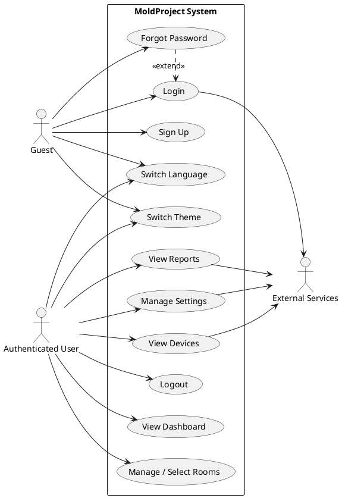

## 3. Activity Diagram - Login

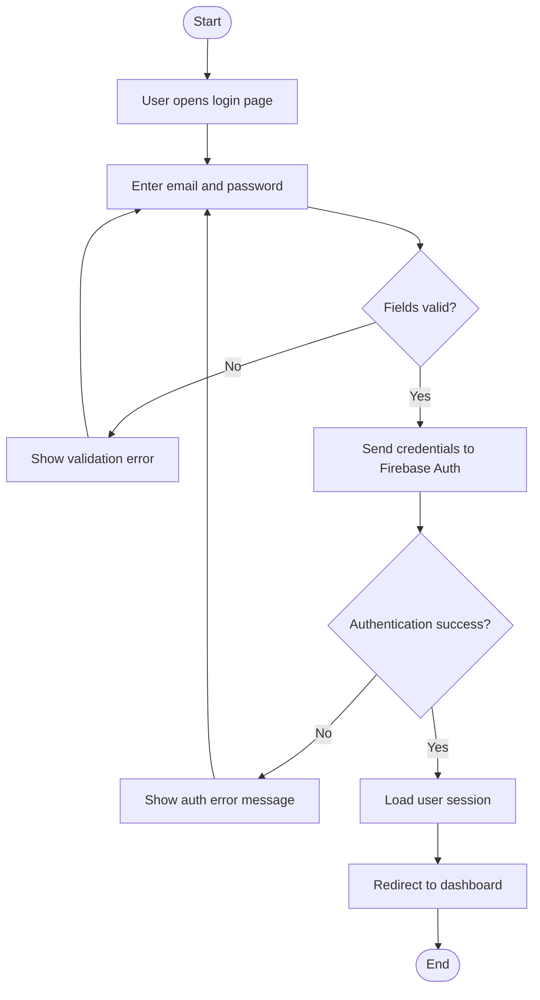

## 4. Activity Diagram - Sign Up

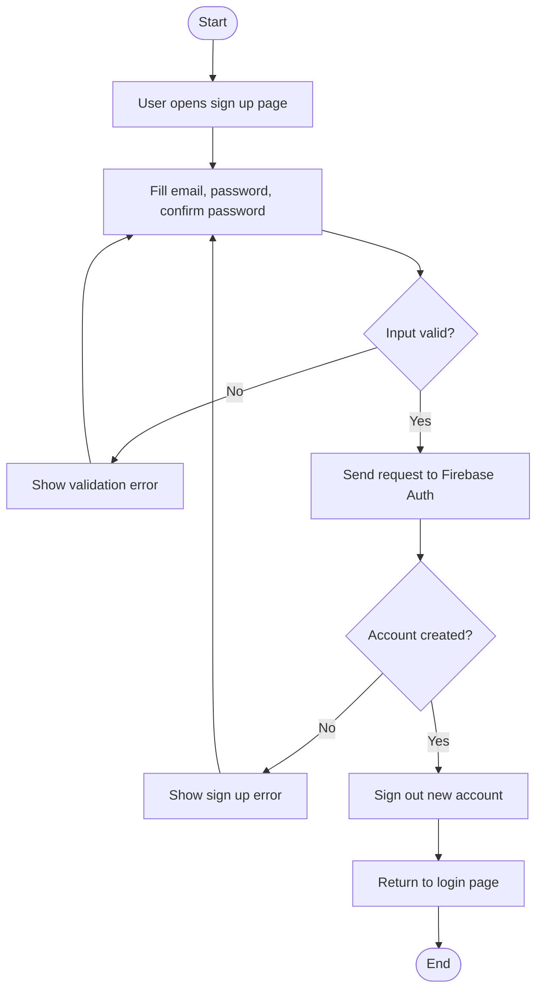

## 5. Activity Diagram - Forgot Password

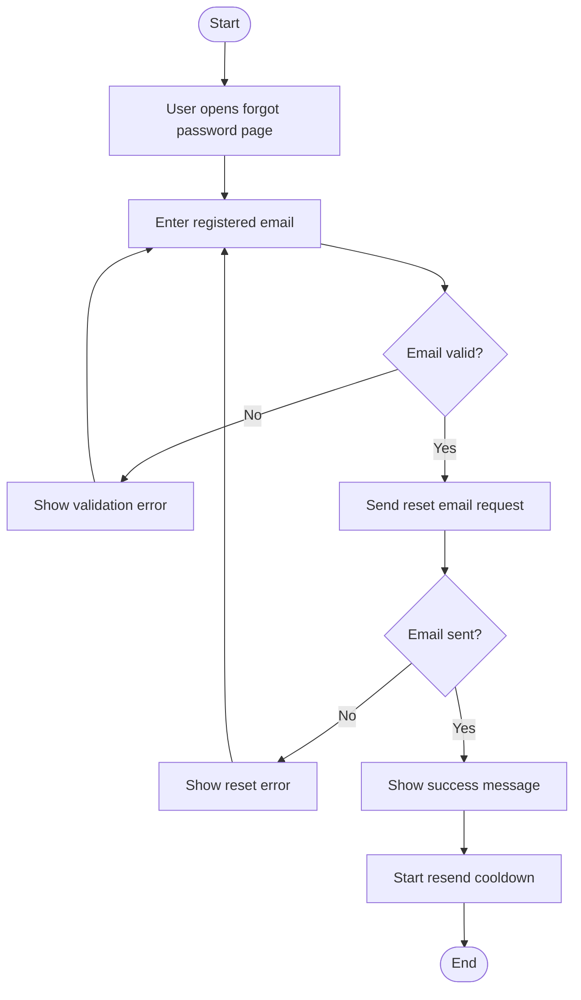

## 6. Activity Diagram - View Dashboard

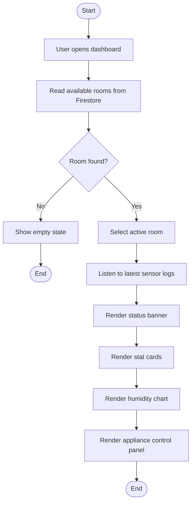

## 7. Activity Diagram - Select / Manage Room

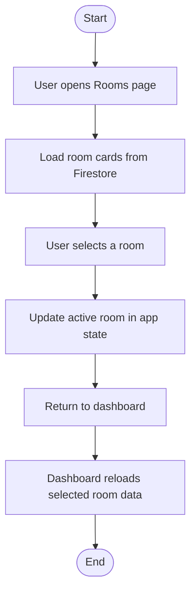

## 8. Activity Diagram - View Devices

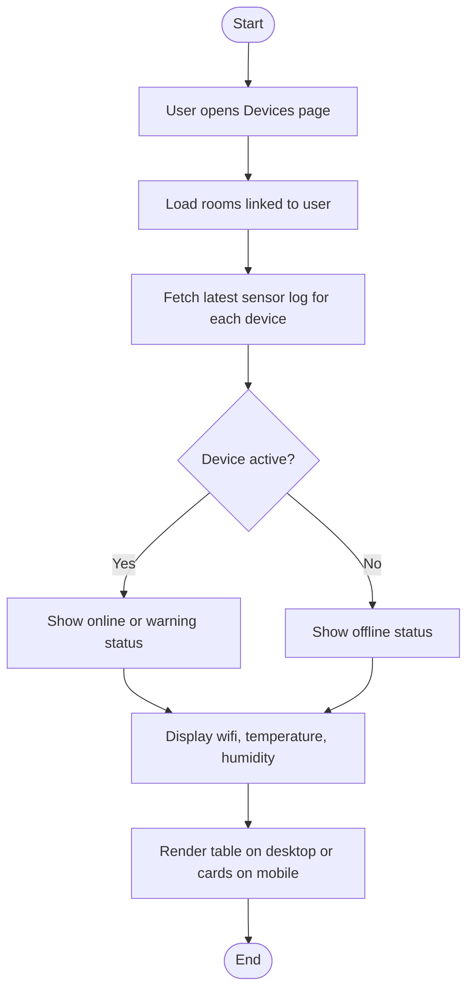

## 9. Activity Diagram - View Reports

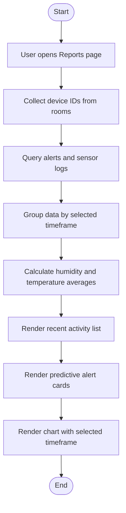

## 10. Activity Diagram - Update Settings

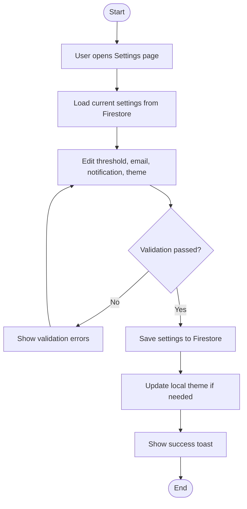

## 11. Activity Diagram - Switch Language / Theme

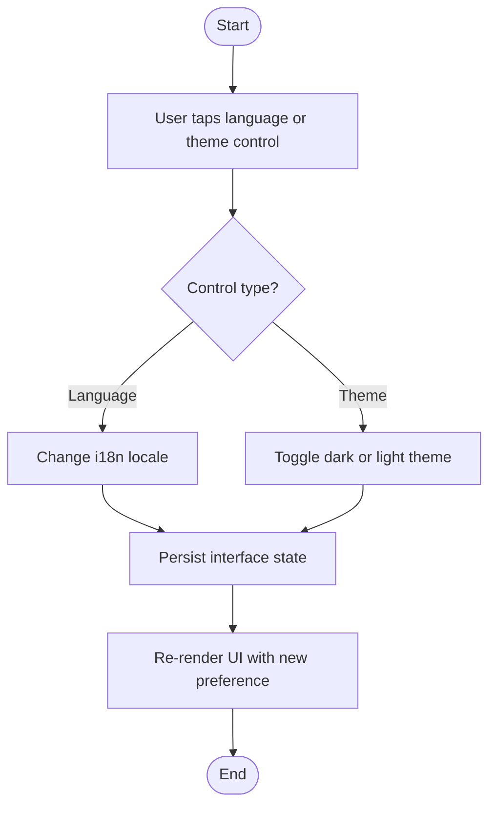

## 12. Activity Diagram - Logout

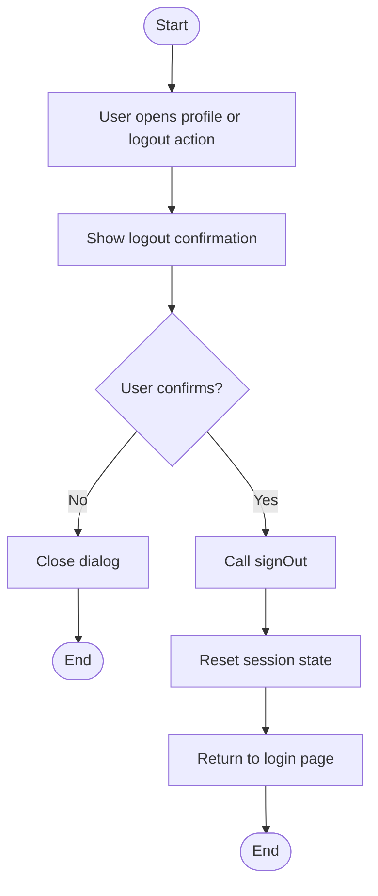

## 13. Catatan Visualisasi

- PNG hasil render tersedia di `docs/assets/` dan sudah memakai notasi swimlane serta simbol activity UML:
  - `uml-use-case.png` (use case UML formal)
  - `uml-activity-login.png`
  - `uml-activity-signup.png`
  - `uml-activity-forgot-password.png`
  - `uml-activity-dashboard.png`
  - `uml-activity-room-management.png`
  - `uml-activity-devices.png`
  - `uml-activity-reports.png`
  - `uml-activity-settings.png`
  - `uml-activity-language-theme.png`
  - `uml-activity-logout.png`
- Struktur diagram sengaja dipisah per fitur agar mudah dipakai untuk manual book atau presentasi.
- Jika Anda mau, saya bisa lanjut buat versi yang lebih formal dalam bentuk diagram PlantUML juga.

## 14. Deployment Diagram

Diagram deployment menggambarkan arsitektur runtime dan aliran data antara perangkat edge, front-end, dan layanan cloud.

Catatan:
- File PNG disimpan di `docs/assets/uml-deployment.png`.
- Diagram dibuat dengan PlantUML dan menggunakan layout `smetana` untuk menghindari ketergantungan Graphviz.

## 15. System Activity Diagram

Diagram aktivitas ini memvisualisasikan aliran data dan workflow runtime satu sistem penanganan sensor:

Ringkasan alur:
- ESP32 mengumpulkan data dan mengirim ke gateway.
- Gateway meneruskan ke Cloud Functions yang melakukan validasi, threshold check, penyimpanan ke Firestore, dan pemicu notifikasi.
- Frontend (Firebase Hosting) mendengarkan update realtime dan menampilkan dashboard.
- Data diekspor periodik ke cluster analytics untuk pemrosesan batch dan pelatihan model.