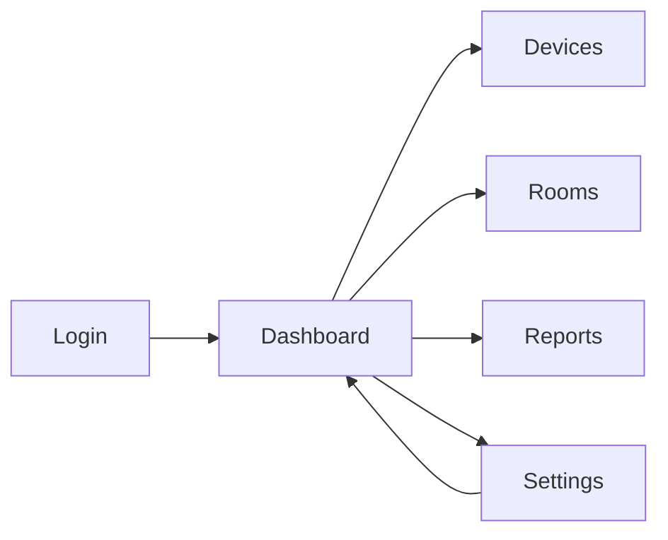

# Manual Pengguna

Manual ini menjelaskan cara menggunakan aplikasi dari sudut pandang pengguna akhir.

## 1. Tujuan Aplikasi

Aplikasi ini digunakan untuk memantau perangkat, ruangan, laporan, dan pengaturan sistem secara realtime.

## 2. Masuk ke Aplikasi

### Langkah-langkah
1. Buka halaman login.
2. Masukkan email dan password.
3. Tekan tombol masuk.
4. Jika kredensial benar, Anda akan diarahkan ke dashboard.

### Screenshot yang Disarankan
- `assets/user-manual-login.png` — halaman login.
- `assets/user-manual-login-error.png` — contoh pesan error login.

## 3. Ganti Bahasa

### Langkah-langkah
1. Cari tombol bahasa di bagian atas halaman.
2. Pilih `EN` atau `ID`.
3. Teks antarmuka akan berubah sesuai bahasa yang dipilih.

### Catatan
- Di mobile, tombol bahasa dibuat lebih ringkas.
- Di desktop, tampilan bahasa tetap mengikuti layout utama.

### Screenshot yang Disarankan
- `assets/user-manual-language-switcher.png` — posisi switcher bahasa.

## 4. Ganti Theme

### Langkah-langkah
1. Buka tombol theme di header atau area login.
2. Pilih mode terang atau gelap.
3. Tampilan aplikasi akan mengikuti pilihan theme.

### Screenshot yang Disarankan
- `assets/user-manual-theme-light.png` — mode terang.
- `assets/user-manual-theme-dark.png` — mode gelap.

## 5. Melihat Dashboard

### Langkah-langkah
1. Setelah login, buka halaman utama.
2. Periksa kartu status, ringkasan perangkat, dan data terbaru.
3. Gunakan navigasi sidebar untuk pindah ke halaman lain.

### Screenshot yang Disarankan
- `assets/user-manual-dashboard.png` — dashboard utama.

## 6. Halaman Devices

### Langkah-langkah
1. Buka menu Devices.
2. Lihat daftar perangkat yang terhubung.
3. Periksa status, ID perangkat, dan data terkait.
4. Di mobile, daftar akan tampil sebagai kartu vertikal agar mudah dibaca.

### Screenshot yang Disarankan
- `assets/user-manual-devices-desktop.png` — devices di desktop.
- `assets/user-manual-devices-mobile.png` — devices di mobile.

## 7. Halaman Rooms

### Langkah-langkah
1. Buka menu Rooms.
2. Lihat ruangan yang sudah terdaftar.
3. Periksa status dan detail yang tersedia.

### Screenshot yang Disarankan
- `assets/user-manual-rooms.png` — halaman rooms.

## 8. Halaman Reports

### Langkah-langkah
1. Buka menu Reports.
2. Pilih rentang data jika tersedia.
3. Lihat grafik atau ringkasan laporan.

### Screenshot yang Disarankan
- `assets/user-manual-reports.png` — halaman reports.

## 9. Halaman Settings

### Langkah-langkah
1. Buka menu Settings.
2. Ubah preferensi yang dibutuhkan.
3. Simpan perubahan.
4. Pastikan perubahan tersimpan di akun Anda.

### Screenshot yang Disarankan
- `assets/user-manual-settings.png` — halaman settings.

## 10. Logout

### Langkah-langkah
1. Klik menu akun atau tombol logout.
2. Konfirmasi tindakan logout.
3. Anda akan kembali ke halaman login.

### Screenshot yang Disarankan
- `assets/user-manual-logout-confirm.png` — dialog konfirmasi logout.

## 11. Panduan Mobile

### Hal yang Perlu Diperhatikan
- Gunakan ukuran layar kecil untuk menguji tampilan mobile.
- Pastikan logout dialog, sidebar, dan device list tetap mudah dibaca.
- Beberapa elemen dipadatkan khusus untuk mobile agar tidak memotong tampilan.

### Screenshot yang Disarankan
- `assets/user-manual-mobile-dashboard.png` — dashboard mobile.
- `assets/user-manual-mobile-sidebar.png` — sidebar mobile.
- `assets/user-manual-mobile-logout.png` — logout mobile.

## 12. Diagram Alur Penggunaan

## 13. Troubleshooting untuk Pengguna

- Jika halaman tidak terbuka, refresh browser lalu coba lagi.
- Jika bahasa tidak berubah, pilih bahasa sekali lagi dan refresh.
- Jika theme terlihat salah, tutup sesi lalu login ulang.
- Jika data tidak muncul, periksa koneksi internet.

## 14. Catatan Screenshot

Simpan semua screenshot final di `docs/assets/` dengan nama file yang konsisten agar mudah dipakai ulang di README atau presentasi.
